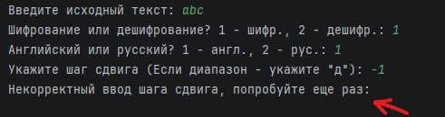

#  Баг репорты - Шифр Цезаря

##  BUG-001 - Шифрование: отрицательный шаг сдвига не обрабатывается при шифровании

## Подробное описание  
При использовании алгоритма шифра Цезаря пользователь может ввести отрицательное значение шага сдвига.  

Согласно требованиям проекта и тест-кейсу **CC-010**, программа должна корректно обрабатывать отрицательный шаг, выполняя сдвиг символов в обратную сторону.

### Требование  
Шаг сдвига должен поддерживать как положительные, так и отрицательные значения (в рамках диапазона алфавита).

### Ожидаемый результат  
Текст корректно сдвигается в обратную сторону.  

**Пример:**  
```text
abc в zab (при шаге -1)
```

### Фактический результат  
При вводе шага -1 функция shift_verify() 
не принимает отрицательное значение, так как метод isdigit() 
возвращает False для отрицательных чисел. 
Программа выводит сообщение "Некорректный ввод шага сдвига, 
попробуйте ещё раз" и запрашивает повторный ввод бесконечно.

---

## Шаги воспроизведения 
1. Запустить программу  
2. Ввести текст: `abc`  
3. Выбрать режим: шифрование  
4. Выбрать язык: 2
5. Ввести шаг сдвига: `-1`  
6. Нажать Enter  

---

## Окружение  
- Среда: Dev (локальная среда)  
- Язык: Python 3.14  
- Тип приложения: консольное  

---

## Severity  
**Высокая**  

### Обоснование  
Дефект нарушает основную функциональность алгоритма шифрования и влияет на типичные пользовательские сценарии.

---

## Priority
**Высокая**  

### Обоснование  
Требуется исправление вне очереди, так как дефект затрагивает базовую бизнес-логику приложения.

---

## Вложения 
 


## Статус  
Fixed


## Связанные артефакты  
- Тест-кейс: CC-010  
- Чек-лист: дополнительные проверки (отрицательный шаг)  
- Тип тестирования: функциональное (граничные значения)

---

## BUG-002 - Выбор языка: английский алфавит не выбирается из-за некорректного сравнения типа данных

## Подробное описание

При выборе английского языка программа должна использовать английский алфавит для шифрования и дешифрования. Согласно требованиям проекта и базовому пользовательскому сценарию, система должна корректно обрабатывать выбор языка. Ошибка вызвана некорректным сравнением значения, возвращаемого функцией `verify()`: функция возвращает строку (`'1'` или `'2'`), однако в коде сравнение выполняется с числом `1`. В результате условие всегда ложно, и программа всегда выбирает русский алфавит.

---

### Требование

Программа должна:

* корректно обрабатывать выбор языка
* использовать английский алфавит при выборе режима `1 - англ.`
* не подменять выбор пользователя другим значением

---

### Ожидаемый результат

При выборе английского языка программа использует английский алфавит.

**Пример:**

```text
Английский или русский? 1 - англ., 2 - рус.:
1
```
Текст abc при шаге 1 преобразуется в bcd.

---

### Фактический результат
Даже при выборе английского языка программа использует русский алфавит, так как условие выбора языка всегда возвращает False.

---

## Шаги воспроизведения
- Запустить программу
- Ввести текст: abc
- Выбрать режим: 1
- Выбрать язык: 1
- Ввести шаг сдвига: 1
- Нажать Enter

---

## Окружение
- Среда: Dev (локальная среда)
- Язык: Python 3.14
- Тип приложения: консольное

---

## Severity
Высокая

### Обоснование
Дефект влияет на базовую функциональность выбора языка и приводит к некорректной работе программы в одном из основных сценариев.

---

## Priority
Высокая

### Обоснование
Ошибка затрагивает основной пользовательский сценарий и должна быть исправлена до релиза.

---

## Вложения
Скриншот отсутствует, баг выявлен при анализе кода и логики работы приложения.

---

## Статус
Fixed

---

## Связанные артефакты
- Тест-кейс: CC-001, CC-006, CC-008
- Чек-лист: основные проверки — выбор языка
- Тип тестирования: функциональное