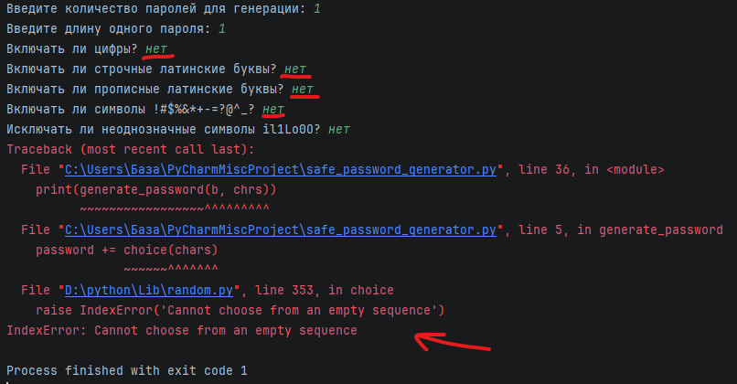
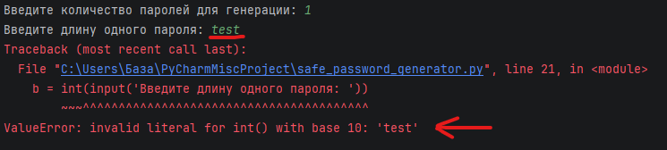
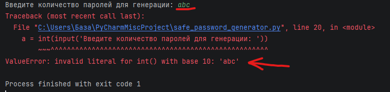

# Баг репорты - Генератор паролей

## BUG-001 - Пустой набор символов

## Подробное описание

При попытке сгенерировать пароль без выбора хотя бы одной группы символов программа падает.

Согласно требованиям проекта и тест-кейсу **PW-010**, программа должна корректно обрабатывать пустой набор символов.

---

### Требование

Программа должна:

* проверять, что выбран хотя бы один тип символов
* не завершать работу с ошибкой при пустом выборе
* выводить сообщение о необходимости корректного выбора

---

### Ожидаемый результат

Программа не падает и запрашивает корректный выбор символов.

**Пример:**

```text
Ошибка: необходимо выбрать хотя бы одну группу символов (цифры, буквы или спецсимволы)
```

### Фактический результат

Программа завершает работу с ошибкой:

```text
IndexError: Cannot choose from an empty sequence
```

## Шаги воспроизведения

* Запустить программу
* Не включать ни одну группу символов
* Попытаться сгенерировать пароль

## Окружение

* Среда: Dev (локальныя среда)  
* Язык: Python 3.14
* Тип приложения: консольное

## Severity

Высокая

### Обоснование

Ошибка блокирует основную функциональность - генерацию паролей.

## Priority

Высокая

### Обоснование

Баг легко воспроизводится и напрямую влияет на работу пользователя.

## Вложения



## Статус

Fixed

## Связанные артефакты

* Тест-кейс: PW-010
* Чек-лист: негативные сценарии (пустой набор символов)
* Тип тестирования: негативное

---

## BUG-002 - Ввод букв в длину пароля

## Подробное описание

При вводе букв вместо числа для длины пароля программа падает.

Согласно требованиям проекта и тест-кейсу **PW-011**, программа должна валидировать ввод и повторно запрашивать корректное значение.

---

### Требование

Программа должна:

* принимать только числовой ввод для длины пароля
* при некорректном вводе повторно запрашивать длину
* не завершать выполнение программы с ошибкой

---

### Ожидаемый результат

* Программа не падает
* Сообщение о некорректном вводе
* Повторный запрос длины пароля

**Пример:**

```text
Ошибка: длина пароля должна быть числом
Введите длину пароля:
```

### Фактический результат

Программа завершает работу с ошибкой:

```text
ValueError: invalid literal for int() with base 10: 'test'
```

## Шаги воспроизведения

* Запустить программу
* Ввести количество паролей: 1
* Ввести длину пароля: `test`
* Нажать Enter

## Окружение

* Среда: Dev (локальныя среда)  
* Язык: Python 3.14
* Тип приложения: консольное

## Severity

Высокая

### Обоснование

Ошибка блокирует генерацию паролей при любом некорректном вводе.

## Priority

Высокая

### Обоснование

Баг легко воспроизводится, напрямую влияет на основную функциональность программы.

## Вложения



## Статус

Fixed

## Связанные артефакты

* Тест-кейс: PW-011
* Чек-лист: негативные сценарии (ввод букв вместо числа)
* Тип тестирования: негативное

---

## BUG-003 - Ввод букв в количество паролей

## Подробное описание

При вводе букв вместо числа для количества паролей программа падает.

Согласно требованиям проекта и тест-кейсу **PW-012**, программа должна валидировать ввод и повторно запрашивать корректное значение.

---

### Требование

Программа должна:

* принимать только числовой ввод для количества паролей
* при некорректном вводе повторно запрашивать количество
* не завершать выполнение программы с ошибкой

---

### Ожидаемый результат

* Программа не падает
* Сообщение о некорректном вводе
* Повторный запрос количества паролей

**Пример:**

```text
Ошибка: количество паролей должно быть числом
Введите количество паролей:
```

### Фактический результат

Программа завершает работу с ошибкой:

```text
ValueError: invalid literal for int() with base 10: 'abc'
```

## Шаги воспроизведения

* Запустить программу
* Ввести количество паролей: `abc`
* Нажать Enter

## Окружение

* Среда: Dev (локальныя среда)  
* Язык: Python 3.14
* Тип приложения: консольное

## Severity

Высокая

### Обоснование

Ошибка блокирует основную функциональность программы.

## Priority

Высокая

### Обоснование

Баг легко воспроизводится и напрямую влияет на работу пользователя.

## Вложения



## Статус

Fixed

## Связанные артефакты

* Тест-кейс: PW-012
* Чек-лист: негативные сценарии (ввод букв вместо числа)
* Тип тестирования: негативное

---

## BUG-004 - Логика: опция исключения неоднозначных символов работает некорректно
## Подробное описание
При выборе опции исключения неоднозначных символов (il1Lo0O) программа игнорирует этот выбор, если пользователь предварительно отказался от включения спецсимволов. 
Согласно требованиям проекта и актуализированному тест-кейсу PW-005, программа должна корректно обрабатывать опцию исключения независимо от ответов на другие вопросы. Ошибка вызвана некорректной проверкой переменной в коде (проверялась переменная ввода спецсимволов вместо переменной исключения).

### Требование
Программа должна:

* корректно обрабатывать выбор пользователя для исключения символов
* исключать символы il1Lo0O из финального набора, если получен ответ "да", независимо от того, выбраны ли спецсимволы
* не пропускать символы при удалении из строки
### Ожидаемый результат
* Программа генерирует пароль
* Символы il1Lo0O гарантированно отсутствуют в итоговом пароле

**Пример:**

```text
Исключать ли неоднозначные символы il1Lo0O? 
да
Пароли:
a2b3c4d5
```
### Фактический результат
Программа генерирует пароли, в которых присутствуют неоднозначные символы, игнорируя команду пользователя на их исключение.

```text
Исключать ли неоднозначные символы il1Lo0O? 
да
Пароли:
a1bOcldO (присутствуют '1', 'O', 'l')
```

## Шаги воспроизведения
* Запустить программу
* Ввести количество паролей: 1
* Ввести длину пароля: 10
* Включать ли цифры: да
* Включать ли строчные латинские буквы: да
* Включать ли прописные латинские буквы: да
* Включать ли символы !#$%&*+-=?@^_?: нет
* Исключать ли неоднозначные символы il1Lo0O?: да
* Нажать Enter

## Окружение
* Среда: Dev (локальная среда)
* Язык: Python 3.14
* Тип приложения: консольное

## Severity
Средняя

### Обоснование
Программа не завершается с ошибкой, однако нарушена бизнес-логика. Функция, напрямую влияющая на безопасность и читаемость пароля, работает некорректно.

## Priority
Высокая

### Обоснование
Пользователь получает пароли с символами, от которых он явно отказался. Это снижает доверие к генератору и может привести к ошибкам при копировании пароля.

## Вложения
Скриншот отсутствует, баг выявлен при аудите кода (Code Review) и дебаггинге логики.

## Статус
Fixed

## Связанные артефакты
* Тест-кейс: PW-005
* Чек-лист: функциональная проверка (исключение неоднозначных символов)
* Тип тестирования: функциональное
